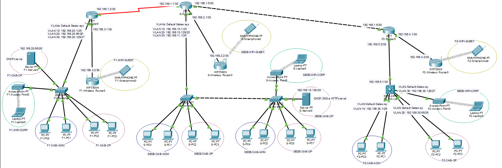
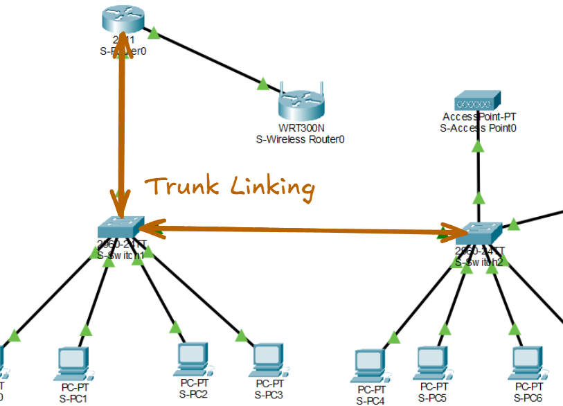

# Trabalho Prático 1 - Redes II

Esse projeto tem como objetivo simular uma rede de uma empresa. Nessa empresa existem 3 unidades que se comunicam via WAN. A Filial 1 (mais a esquerda) representa uma estrutura mais antiga (usando *ROAS* e link WAN serial). Já a Filial 2 (mais a direita) representa uma estrutura mais moderna (usando L3 Switch e WAN ethernet). A Sede é a estrutura central, que conecta as duas filiais, oferecendo o serviço HTTP e DNS. A imagem abaixo mostra a topologia das redes da empresa.



Abaixo segue como foi pensado as distribuições/divisões/**subnetting**  de IPs para atender os requisitos.

| Unidade  | Nome               | VLAN | Rede              | Mascara         | Gateway        | Primeiro host  | Ultimo host    | Broadcast      |
| -------- | ------------------ | ---- | ----------------- | --------------- | -------------- | -------------- | -------------- | -------------- |
| Sede     | SEDE-CAB-ADM       | 10   | 192.168.10.0/25   | 255.255.255.128 | 192.168.10.1   | 192.168.10.1   | 192.168.10.126 | 192.168.10.127 |
| Sede     | SEDE-CAB-OP        | 20   | 192.168.10.128/25 | 255.255.255.128 | 192.168.10.129 | 192.168.10.129 | 192.168.10.254 | 192.168.10.255 |
| Sede     | SEDE-WIFI-CORP     | 30   | 192.168.11.0/26   | 255.255.255.192 | 192.168.11.1   | 192.168.11.1   | 192.168.11.62  | 192.168.11.63  |
| Sede     | SEDE-WIFI-GUEST    | ---  | 192.168.0.0/24    | 255.255.255.0   | 192.168.0.1    | 192.168.0.1    | 192.168.0.254  | 192.168.0.255  |
| Filial 1 | FILIAL1-CAB-ADM    | 10   | 192.168.20.0/26   | 255.255.255.192 | 192.168.20.1   | 192.168.20.1   | 192.168.20.62  | 192.168.20.63  |
| Filial 1 | FILIAL1-CAB-OP     | 20   | 192.168.20.64/26  | 255.255.255.192 | 192.168.20.65  | 192.168.20.65  | 192.168.20.126 | 192.168.20.127 |
| Filial 1 | FILIAL1-WIFI-CORP  | 30   | 192.168.20.128/27 | 255.255.255.224 | 192.168.20.129 | 192.168.20.129 | 192.168.20.158 | 192.168.20.159 |
| Filial 1 | FILIAL1-WIFI-GUEST | ---  | 192.168.0.0/24    | 255.255.255.0   | 192.168.0.1    | 192.168.0.1    | 192.168.0.254  | 192.168.0.255  |
| Filial 2 | FILIAL2-CAB-ADM    | 10   | 192.168.30.0/26   | 255.255.255.192 | 192.168.30.1   | 192.168.30.1   | 192.168.30.62  | 192.168.30.63  |
| Filial 2 | FILIAL2-CAB-OP     | 20   | 192.168.30.64/26  | 255.255.255.192 | 192.168.30.65  | 192.168.30.65  | 192.168.30.126 | 192.168.30.127 |
| Filial 2 | FILIAL2-WIFI-CORP  | 30   | 192.168.30.128/27 | 255.255.255.224 | 192.168.30.129 | 192.168.30.129 | 192.168.30.158 | 192.168.30.159 |
| Filial 2 | FILIAL2-WIFI-GUEST | ---  | 192.168.0.0/24    | 255.255.255.0   | 192.168.0.1    | 192.168.0.1    | 192.168.0.254  | 192.168.0.255  |
 
Todas as decisoes de projeto e a relacao dos equipamentos de rede utilizados foram documentadas ao longo deste relatorio. Tecnologias, configuracoes e escolhas que se repetem entre as unidades nao foram explicadas novamente em cada secao, para evitar redundancia e manter a documentacao mais objetiva.
### Sede
| Nome            | VLAN | Rede                  | Gateway        | Broadcast      |
| --------------- | ---- | --------------------- | -------------- | -------------- |
| SEDE-CAB-ADM    | 10   | 192.168.10.0**/25**   | 192.168.10.1   | 192.168.10.127 |
| SEDE-CAB-OP     | 20   | 192.168.10.128**/25** | 192.168.10.129 | 192.168.10.255 |
| SEDE-WIFI-CORP  | 30   | 192.168.11.0**/26**   | 192.168.11.1   | 192.168.11.63  |
| SEDE-WIFI-GUEST | ---  | 192.168.0.0/**24**    | 192.168.0.1    | 192.168.0.255  |
#### VLANs
Entre os switchs e entre o switch e o router foram usado interfaces **gig** *GigabitEthernet* (até 1000 Mbps) ao invés de **fa** *FastEthernet* (até 100 Mbps). Usar as portas de maior capcidade para esses links faz sentido pois eles estão em trunk mode (podendo carregar o tráfego de várias vlans ao mesmo tempo).

Para criar e configurar as 3 vlans é nescessário seguir os passos abaixo.
##### 1. Entrar em modo de configuração
```bash
enable                # sudo (modo privilegiado)
configure terminal    # modo de configuração global
```
##### 2. Criar as VLANs
```bash
vlan 10 # criar VLAN com ID 10.  se já existe, entra no modo de configuração dela
	name SEDE-CAB-ADM
exit
vlan 20
 name SEDE-CAB-OP
exit
vlan 30
 name SEDE-WIFI-CORP
exit

do show vlan brief # ver as VLANs criadas
```
##### 3. Atribuir access ports
```bash
interface range fa0/1 - 2 # entra em modo de config para fa0/[1-2]
 switchport mode access # força porta ser access 
 switchport access vlan 10
exit # tudo configurado foi aplicado simultaneamente para as ifs

interface range fa0/3 - 4
 switchport mode access # access mode é o contrário de trunk, apenas 1 vlan
 switchport access vlan 20
exit
```
##### 4. Configurar os trunks
```bash
interface gig0/1 # entra na porta Gigabit 0/1
 switchport mode trunk # múltiplas VLANs simultaneamente
 switchport trunk allowed vlan 10,20,30
exit
interface gig0/2
 switchport mode trunk
 switchport trunk allowed vlan 10,20,30
exit
```
##### 5. Salvar
```bash
end # sai de qualquer modo de config aninhado e volta para o modo privilegiado
write memory # salva a configuração atual
```

#### Server
O servidor foi conectado ao `S-SW2` na `SEDE-CAB-OP` (a `VLAN 20`) ao invés de se conectar a `SEDE-CAB-ADM` (a `VLAN 10`). Isso se justifica pois faz mais sentido lógicamente o servidor se conectar na rede operacional (junto com devs, maquinas IOTs e etc) do que na rede administrativa.

É preciso configurar  IP estático no servidor. No Server-PT, aba Desktop → IP Configuration:
- **IPv4:** `192.168.10.130`
- **Subnet:** `255.255.255.128`
- **Gateway:** `192.168.10.129` (gateway da VLAN 20, onde o servidor está)
- **DNS Server:** `192.168.10.130` (ele mesmo)
Depois de configurar [Router config](#router), habilitar DHCP service
#### Router
Por default, as VLANs são incapazes de comunicarem entre si. Para resolver esse problema, foi implementado o roteamento entre VLANs usando a técnica **ROAS** - *Router on a Stick*. Ou seja, ao invés de usar um cabo físico separado conectado ao router para **CADA** VLAN, foi utilizado um único cabo, onde os quadros de cada VLAN são identificados por **tags** (802.1Q). Sendo assim, a porta do switch conectada ao router fica em modo **trunk** e o router cria subinterfaces virtuais para cada VLAN.

É preciso configurar o "stick" do *ROAS*, fazer o roteador (em um mesmo link) ser capaz de rotear corretamente os pacotes para as vlans.
##### 1. Entrar no modo de configuração e definir hostname
```bash
enable
configure terminal
hostname S-Router0 # muda o nome do equipamento
```
##### 2. Levantar a interface física que vai para o SW1
```bash
interface gig0/0 # a if gig0/0 é a que está linkada no sw1
 description TRUNK-PARA-SW1 # comentário descritivo da porta
 no shutdown # por default, as ifs vem desativadas (ao contrario dos sws)
exit
```
##### 3. Subinterface VLAN 10 - \[SEDE-CAB-ADM\]
```bash
interface gig0/0.10 # .10 indica subif if "filha" de gig0/0  
 description GATEWAY-VLAN10-ADM
 encapsulation dot1Q 10 # subif vai responder pelos frames taggeados como vlan 10
 ip address 192.168.10.1 255.255.255.128 # default gateway da vlan 10
 ip helper-address 192.168.10.130 # como o dhcp srv ta na vlan 20, é preciso fzer que os dhcps broadcast que chegam na vlan 10 não "morram" e sejam convertido para unicast encaminhado para o srv dhcp 192.168.10.130 que está na vlan 20. !!Sem isso, só PCs da mesma VLAN do servidor (VLAN 20) conseguiriam pegar IP.!!
exit
```
##### 4. Subinterface VLAN 20 - \[SEDE-CAB-OP\]
```bash
interface gig0/0.20
 description GATEWAY-VLAN20-OP
 encapsulation dot1Q 20
 ip address 192.168.10.129 255.255.255.128
 ip helper-address 192.168.10.130 # NÃO É NESCESSÁRIO, dhcp srvr já está na vlan 20!! (mas é uma boa prática. se você mover o servidor amanhã, não precisa lembrar de mexer aqui)
exit
```
##### 5. Subinterface VLAN 30 - \[SEDE-WIFI-CORP\] 
```bash
interface gig0/0.30
 description GATEWAY-VLAN30-WIFI-CORP
 encapsulation dot1Q 30
 ip address 192.168.11.1 255.255.255.192 # /26
 ip helper-address 192.168.10.130
exit
```
##### 6. Interface ponto-a-ponto
```bash
interface gig0/1
 description LINK-PARA-WRT300N-GUEST
 ip address 192.168.2.1 255.255.255.252 # /30
 no shutdown # ligar a porta gig0/1
exit
```
##### 7. Salvar e sair
```bash
end
write memory
```

#### DHCP Service
O protocolo para alocar IPs dinâmicos DHCP no geral segue os seguintes passos para funcionar:
1. **DHCP Discover**: cliente ainda não tem IP. envia em broadcast de origin `0.0.0.0` para `255.255.255.255`
  2. **DHCP Offer**: srv oferece um IP. Normalmente pode ir como broadcast ou unicast, dependendo do caso/implementação.
  3. **DHCP Request**: cliente pede oficialmente aquele IP. geralmente broadcast, porque ele também avisa outros srvs DHCPs que escolheu uma oferta.
  4. **DHCP Ack**: srv confirma. pode ser broadcast ou unicast, dependendo do estado do cliente/flags.
No entanto, como há apenas 1 DHCP Server, e ele está na VLAN 20 (operacional), é nescessário configurar no router o **DHCP relay**, para não deixar os pedidos de DHCP das outras VLANs "morrerem". Agora eles devem ser encaminhados em unicast para o `192.168.10.130/25` (o IP do servidor).
Pool é a config do conjunto de addrs que o DHCP service pode entregar. Vale ressaltar que existe uma folga entre o primeiro host verdadeiro da vlan e o start ip do pool. É uma boa prática reservar esse espaço para caso seja nescessário expandir a rede com impressoras, cameras, sw gerenciaveis e outros devices que precisam de IPs estáticos.
##### Pool 1 - VLAN 10 \[ADM\]
| Campo                   | Valor             |
| ----------------------- | ----------------- |
| Pool Name               | `SEDE-ADM`        |
| Default Gateway         | `192.168.10.1`    |
| DNS Server              | `192.168.10.130`  |
| Start IP Address        | `192.168.10.10`   |
| Subnet Mask             | `255.255.255.128` |
| Maximum Number of Users | `100`             |
| TFTP Server             | `0.0.0.0`         |
| WLC Address             | `0.0.0.0`         |
**OBS**: Folga para IPs estáticos do `.2` ao `.9`
##### Pool 2 - VLAN 20 \[OP\]
| Campo                   | Valor             |
| ----------------------- | ----------------- |
| Pool Name               | `SEDE-OP`         |
| Default Gateway         | `192.168.10.129`  |
| DNS Server              | `192.168.10.130`  |
| Start IP Address        | `192.168.10.140`  |
| Subnet Mask             | `255.255.255.128` |
| Maximum Number of Users | `100`             |
**OBS**: Folga para IPs estáticos do `.131` ao `.139`
##### Pool 3 - VLAN 30 \[WIFI-CORP\]
| Campo                   | Valor             |
| ----------------------- | ----------------- |
| Pool Name               | `SEDE-WIFI-CORP`  |
| Default Gateway         | `192.168.11.1`    |
| DNS Server              | `192.168.10.130`  |
| Start IP Address        | `192.168.11.10`   |
| Subnet Mask             | `255.255.255.192` |
| Maximum Number of Users | `50`              |
**OBS**: Folga para IPs estáticos do `.2` ao `.9`
##### Alterar `serverPool`
O serverPool é um pool default "protegido" do PKT não é possível deletar, só editar. Dessa forma, é preciso **neutralizar** ele para não interferir na distribuição dos IPs das vlans. Em vez de remover, edita ele para apontar para uma rede "fantasma" que nenhum cliente seu usa:
1. Clica em `serverPool` na lista para selecionar.
2. Muda os campos para:
    - **Default Gateway:** `0.0.0.0`
    - **DNS Server:** `0.0.0.0`
    - **Start IP Address:** `10.99.99.1`
    - **Subnet Mask:** `255.255.255.0`
    - **Maximum Number of Users:** `1`
3. Clica **Save**.
#### DNS Service
Aba **Services** → **DNS**. **Liga:** DNS Service → **On**.
**Adiciona um registro A:** `http://www.naisseslegal.com` mapeando para `192.168.10.130` (o próprio IP do servidor, onde o index.html vai ser servido pelo [HTTP Service](#http-service)).
#### HTTP Service
Aba **Services** → **HTTP**. Garante que **HTTP** está **On** (HTTPS pode deixar on também, é opcional).
No painel à direita, tem o arquivo `index.html`. Clica em **(edit)** ao lado dele e substitui o conteúdo.
#### APs
O AP em modo bridge, diferentemente do modo NAT, não cria uma rede nova, ele só pega o frame Ethernet do cliente Wi-Fi e joga no cabo, e vice-versa. O cliente wireless aparece na rede cabeada como se estivesse plugado diretamente no switch. No entanto, apesar de não precisar explicitamente criar uma nova rede para bridge, foi implementado a `WIFI-CORP` (`VLAN 30`) para seguir a melhor prática. O meio físico wireless é uma superfície de ataque maior, dessa forma, mesmo a rede sendo para usuários internos, é uma boa prática separar da rede cabeada interna.

Já o AP em modo NAT, diferentemente do modo Bridge, ele cria uma rede nova, a `WIFI-GUEST`, com DHCP server, ARP, default gateway e etc. Para conectar a LAN interna do AP NAT com a WAN/exterior poderia ter sido criado uma nova VLAN `VLAN 40` de trânsito.  A rede dessa VLAN teria uma máscara `/31` (*Seguindo a RFC 3021, `/31` é suportado em enlaces ponto-a-ponto sem consumir endereços para rede e broadcast.*), já que teria apenas 2 endereços úteis. No entanto, optou-se por por conectar o AP diretamentamente no router para fins de simplicidade e eficiencia.

É importante ressaltar que o no lado WAN do AP NAT o DHCP não funciona. Além de não termos configurado (até porque não compensa) uma pool para a rede ponto-a-ponto, o broadcast do DHCP não "atravessaria" o roteador (a menos que  configurado). Por isso, optou-se pelo IP stático no lado WAN:
- **IPv4 Address**: `192.168.2.2/30`
- **Default Gateway**: `192.168.2.1` 
- **DNS Server**: `192.168.10.130`
O lado WAN do AP NAT é conectado ponto a ponto
- **SSID**: SEDE-WIFI-GUEST
- **Auth**:  WPA2-PSK
- **Encryption**: AES
- **Passphrase**: naisseslegal
### Conexão Filial 1 ↔ Sede
Para conectar F1 é preciso de uma conexao ponto-a-ponto.  No entanto, há um problema. TODAS as portas  atuais do router da Sede ficariam  se conectasse alguma das filiais, impedindo do router da Sede se conctar futuramente com a Filial 2. Para contornar isso, é preciso adicionar  placa de expansão `HWIC` no roteador, adicionando mais portas/interfaces. Há a possibilidade de escolha de vários tipos de portas para serem expandidas, como:
  - HWIC Ethernet/FastEthernet/GigabitEthernet: adiciona portas Ethernet.
  - HWIC Serial: adiciona portas seriais WAN.
  - HWIC com switch: adiciona várias portas de switch no roteador.
A tecnologica **ethernet** (com cabos coaxiais, par trançado, fibra óptica...) foi originalmente projetado para LAN. Hoje em dia é padrão de WANs usarem entre roteadores por serem mais eficientes (alta velocidade, full-duplex e está mais barato). Historicamente, para links longos entre cidades/países o padrão (pelo menos era) a tecnologia **serial**. Ppara simular empresas legados, optou-se por utilizar no projeto a tecnologia serial entre os roteadores das filiais e sede.
#### Enlace serial
"Serial" é um conceito amplo de enviar bits em sequencia, um depois do outro, por um canal. Não é um tecnologia única. A interface serial de enlace é uma tecnologia de **camada física + camada de enlace** usada para conectar roteadores ponto-a-ponto.

**L1** (físico)
- cabo serial
- sinal elétrico
- DCE/DTE
- clock rate
- conector/interface serial.

**L2** (enlace)
 - protocolo que organiza os quadros no link;
- normalmente HDLC ou PPP.
##### Protocolos
Diferentemente da ethernet, na serial é preciso escolher o protocolo de enlace que vai "empacotar" os frames. Os dois principais:
##### Clock
- **DCE (Data Communications Equipment):** o lado que **gera o clock**. Historicamente, era o modem/CSU-DSU fornecido pela operadora.
- **DTE (Data Terminal Equipment):** o lado que **recebe o clock**. Historicamente, era o roteador do cliente.
O **clock rate** é a velocidade/**taxa de sincronização** de um link serial. Em uma conexão serial, os bits são enviados em sequência (`101100101...` ). Para o outro lado entender corretamente, ele precisa saber em que ritmo esses bits estão chegando. Esse ritmo é o clock. Em uma WAN real, a operadora (provedor de circuitos) é DCE e o cliente é DTE. No projeto, DCE do lado da sede faz sentido semanticamente — a sede é a "matriz" que serve as filiais. 
##### Configuração
As portas Gig faziam 1 Gbps. As serial fazem algo entre 56 kbps e 2 Mbps (dependendo da config de clock). É **muito mais lento**, o que é realista — WANs seriais são tipicamente links de 64k, 128k, 256k, 1M, 2M (T1/E1). Para o projeto optou-se por configurar `64000` bps (64 kbps), que é o default e suficiente para ping/HTTP.
###### Router DCE
```bash
enable
configure terminal

! Remover a config antiga da Gig0/2 (era o link Ethernet para F1)
interface gig0/2
 shutdown
 no ip address
exit

! Configurar a nova interface serial para F1
interface serial0/0/0
 description WAN-SEDE-FILIAL1
 ip address 192.168.1.1 255.255.255.252
 encapsulation ppp # PPP
 clock rate 64000 # gera clock de 64 kbps para o link
 no shutdown
exit

end
write memory
```
###### Router DTE
```bash
enable
configure terminal
hostname F1-Router0

interface serial0/0/0
 description WAN-FILIAL1-SEDE
 ip address 192.168.1.2 255.255.255.252
 encapsulation ppp # mesmo encapsulamento
 no shutdown
exit

end
write memory
```


#### Roteamento estático
A comunicação entre a sede e a filial foi feita utilizando uma rota estática em cada um dos routers.

> *"para chegar em tal rede, encaminhe o pacote para tal next-hop"*
##### Default route na Filial 1
A filial 1 só tem um único caminho para sair. Então, em vez de listar rotas específicas para cada rede da sede, usamos uma **rota default** que cobre tudo.
```bash
enable
configure terminal
ip route 0.0.0.0 0.0.0.0 192.168.1.1 # "para qualquer destino IP que eu não tenha uma rota mais específica, encaminhe para `X`"
end
write memory
```
O `192.168.1.1` é o IP do S-Router0. É o **next-hop**
##### Summary route na Sede
A sede precisa saber chegar nas redes da Filial 1. Em vez de 3 rotas (uma por VLAN), utiliza-se de **uma rota sumária (/24)** que cobre todo o `192.168.20.0/24`. Isso é chamado de **supernetting**, `192.168.20.0/24` engloba as 3 VLANs da Filial 1 (`.0/26`, `.64/26`, `.128/27`) em uma única entrada.
```bash
enable
configure terminal
ip route 192.168.20.0 255.255.255.0 192.168.1.2
end
write memory
```
`192.168.1.2` é o IP do F1-Router0 na outra ponta do serial.
### Filial 1
| Nome               | VLAN | Rede                  | Gateway        | Broadcast      |
| ------------------ | ---- | --------------------- | -------------- | -------------- |
| FILIAL1-CAB-ADM    | 10   | 192.168.20.0**/26**   | 192.168.20.1   | 192.168.20.63  |
| FILIAL1-CAB-OP     | 20   | 192.168.20.64**/26**  | 192.168.20.65  | 192.168.20.127 |
| FILIAL1-WIFI-CORP  | 30   | 192.168.20.128**/27** | 192.168.20.129 | 192.168.20.159 |
| FILIAL1-WIFI-GUEST | ---  | 192.168.0.0/**24**    | 192.168.0.1    | 192.168.0.255  |
As unidades filiais são mais enxutas que a sede, então um único switch com 24 portas comporta tudo (AP bridge + uplink + 20 PCs = 22 portas). O servidor DNS/HTTP da sede atende todas as unidades. Para a implementação do DHCP service, poderia ser feito via WAN (com DHCP relay, a filial encaminha pedidos para o `192.168.10.130` na sede). No entanto, optou-se por descentralizar para um DHCP local, em que o próprio router da filial encaminha para um DHCP service que fica na filial. Já o DNS server foi utilizado o da sede (`192.168.10.130`).
Assim como a sede, a Filial 1 foi feita a topologia de rotemaento *ROAS*.
### Filial 2
| Nome               | VLAN | Rede                  | Gateway        | Broadcast      |
| ------------------ | ---- | --------------------- | -------------- | -------------- |
| FILIAL2-CAB-ADM    | 10   | 192.168.30.0**/26**   | 192.168.30.1   | 192.168.30.63  |
| FILIAL2-CAB-OP     | 20   | 192.168.30.64**/26**  | 192.168.30.65  | 192.168.30.127 |
| FILIAL2-WIFI-CORP  | 30   | 192.168.30.128**/27** | 192.168.30.129 | 192.168.30.159 |
| FILIAL2-WIFI-GUEST | ---  | 192.168.0.0/**24**    | 192.168.0.1    | 192.168.0.255  |
**Para permitir a comunicação entre VLAN**, na filial 2 não foi implementado o *ROAS* e nem cada VLAN se conectando com uma certa interface física do router (dummy). Optou-se por utilizar um **Layer 3 Switch** para simumlar o padrão enterpraise atual. Além disso, é possível tambem colocar o servidor DHCP no próprio switch.
#### Switch L3
Diferentemente do sw "normal", para cada VLAN é criado uma **SVI** (*Switch Virtual Interface*). Como o tráfego fica dentro do switch (não "sobe e desce no stick", há menos gargalo (e, por consequencia, menor latência).
##### Habilitar roteamento
```bash
enable
configure terminal
hostname F2-SW-L3
ip routing # habilita o uso da L3
```
##### VLANs
```bash
vlan 10
 name FILIAL2-CAB-ADM
vlan 20
 name FILIAL2-CAB-OP
vlan 30
 name FILIAL2-WIFI-CORP
exit
```
##### Atribuir Access ports
```bash
interface range fa0/1-2
 switchport mode access
 switchport access vlan 10
 description VLAN 10 ADM - PCs

interface range fa0/3-4
 switchport mode access
 switchport access vlan 20
 description VLAN 20 OP - PCs

interface fa0/5
 switchport mode access
 switchport access vlan 30
 description VLAN 30 WIFI-CORP - AP Bridge
```
##### Configurar a porta roteada
```bash
interface fa0/24
 no switchport # converte a porta de L2 pra L3. A partir daí, ela não participa de VLAN nenhuma, não tem MAC address na tabela de VLAN, é uma interface roteada pura
 ip address 192.168.5.1 255.255.255.252 # /30
 description Link L3 para F2-Router0
 no shutdown
```
`Fa0/24` agora não é é VLAN nenhuma e nem trunk. É uma porta de roteador, com IP próprio.
##### Criar as SVIs
É o equivalente de uma subif de ROAS. Cada VLAN precisa de uma **SVI** pra ter um default gateway L3.
```bash
interface vlan 10
 ip address 192.168.30.1 255.255.255.192
 description Gateway VLAN 10 ADM
 no shutdown

interface vlan 20
 ip address 192.168.30.65 255.255.255.192
 description Gateway VLAN 20 OP
 no shutdown

interface vlan 30
 ip address 192.168.30.129 255.255.255.224
 description Gateway VLAN 30 WIFI-CORP
 no shutdown
```
O switch sabe que a SVI `vlan x` pertence à VLAN x porque o número bate.
##### DHCP local no próprio switch
```bash
ip dhcp excluded-address 192.168.30.1 192.168.30.10 # impede o DHCP de sortear os IPs 1-10 (reservados pra gateways, impressoras, etc.)
ip dhcp excluded-address 192.168.30.65 192.168.30.74
ip dhcp excluded-address 192.168.30.129 192.168.30.138

ip dhcp pool VLAN10-ADM
 network 192.168.30.0 255.255.255.192
 default-router 192.168.30.1
 dns-server 192.168.10.130

ip dhcp pool VLAN20-OP
 network 192.168.30.64 255.255.255.192
 default-router 192.168.30.65
 dns-server 192.168.10.130

ip dhcp pool VLAN30-WIFI-CORP
 network 192.168.30.128 255.255.255.224
 default-router 192.168.30.129
 dns-server 192.168.10.130
exit
```
##### Default route
```bash
enable
configure terminal
ip route 0.0.0.0 0.0.0.0 192.168.5.2
```
"Pra qualquer coisa que eu não conheço, manda pro `192.168.5.2` (router)".
##### Salvar
```bash
end
write memory
```
### Conexão Filial 2 ↔ Sede
Ao invés de usar link serial, foi utilizado ethernet  por ser o padrao de link WAN atualmente. Além disso, o roteamento foi implementado de forma dinâmica. Ou seja, não é preciso mais de configurar manualmente as rotas, a filial e a sede aprendem as redes automaticamente. O protocolo usado foi o [OSPF](#ospf-open-shortest-path-first)
#### OSPF (Open Shortest Path First)
É link-state (se preocupa com a band-width para tomar sua decisão). Usa algoritmo Dijkstra pra calcular melhor caminho baseado em _cost_. Cada router constrói um "mapa" topológico completo da rede.
##### OSPF no S-Router0
```bash
enable
configure terminal

router ospf 1
 router-id 1.1.1.1
 network 192.168.1.4 0.0.0.3 area 0 
 network 192.168.10.0 0.0.0.127 area 0
 network 192.168.10.128 0.0.0.127 area 0
 network 192.168.11.0 0.0.0.63 area 0 # entra no OSPF as 3 subifs VLAN + o link ethernet pra F2
 passive-interface GigabitEthernet0/0.10
 passive-interface GigabitEthernet0/0.20
 passive-interface GigabitEthernet0/0.30 # as VLANs não precisam ouvir/enviar hellos pra switches, seria ruído
 redistribute static subnets
 exit

end
write memory
```
##### OSPF no F2-Router0
```bash
enable
configure terminal

router ospf 1
 router-id 2.2.2.2 # diferente do sede
 network 192.168.1.4 0.0.0.3 area 0
 passive-interface GigabitEthernet0/0
 passive-interface GigabitEthernet0/1
 redistribute static subnets
 exit

end
write memory
```
### Testes de Conexão
Abaixo seguem diversos testes que foram realizados para assegurar a corretude do projeto.
#### S-PC0 ↔ S-PC7
```bash
ping 192.168.10.143 # entre diferentes vlans. funciona
```
#### F2-Router0 ↔ S-Server0
```bash
# F2 router para S-Server
ping 192.168.10.130    ← S-Server0 (DNS/DHCP/HTTP da sede)
ping 192.168.20.66     ← F1-Server0 (através da sede via estático)
ping 192.168.20.1      ← gateway VLAN 10 da F1
```
#### F2-Smartphone
```bash
ping 192.168.30.76 # F2-PC/vlan 20. funciona 
ping 192.168.10.140 # SEDE-PC/vlan 20. não funciona 
```
Os device que se conectam com o AP NAT só conseguem 
## Referências
- [YT - What is a Router on a Stick](https://youtu.be/8PcKjKFWvAY?si=MXzKWjqV9_qL1EnX)
- [YT - What is Ethernet?](https://youtu.be/HLziLmaYsO0?si=h9lfSlmeMl_J3u8B)
- [YT - INTRODUÇÃO A OSPF](https://youtu.be/_kPMh7nQrYQ?si=e9D15iAPcjsdq1iY)
- [YT - Exploring Simulation Mode within CISCO Packet Tracer](https://youtu.be/8FP5MreGxsI?si=JEVlYrIXVZJCvu9b)
